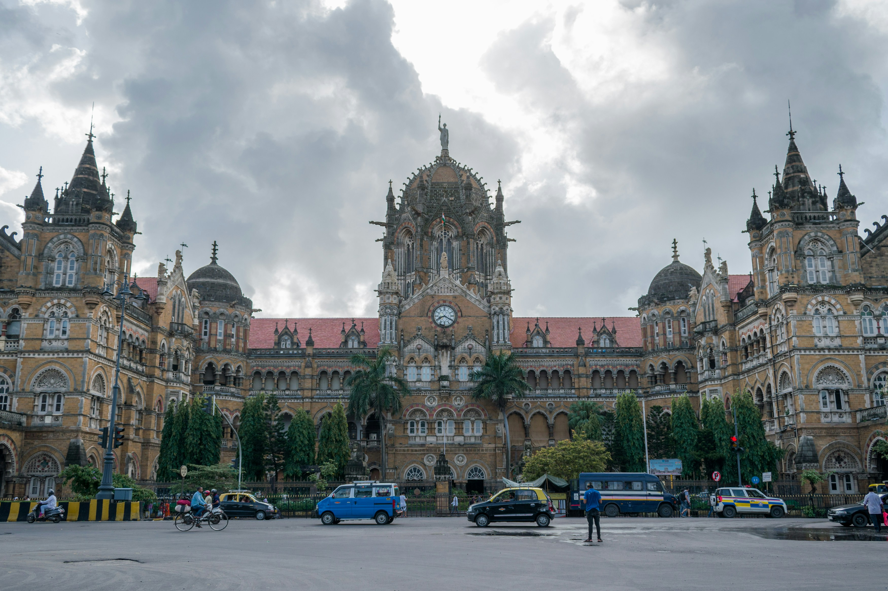

# Parallax Travel Page 🌍

This project presents five beautiful Indian destinations — Mumbai, Jaipur, Indore, Kolkata, and Manali — through a modern **parallax scrolling** layout. It highlights each city with background images, informative text sections, and a smooth "Back to Top" button.

[Click here to view the live demo](https://adi-shinde31.github.io/ParallaxWebsite/)

### 🏙️ Cities Featured

- **Mumbai**
- **Jaipur**
- **Indore**
- **Kolkata**
- **Manali**

---

## 🛠️ Tech Stack

- **HTML5**
- **CSS3**
- Responsive Web Design
- Parallax Effect using `background-attachment: fixed`

---

## 📌 Features

- 🌄 Stunning parallax scroll sections
- 📱 Fully responsive layout for mobile and desktop
- 🔝 Fixed “Back to Top” button
- 🎨 Clean and modern UI
- ⚡ Lightweight and fast loading

---

## 📁 Folder Structure

```
parallax-website/
├── index.html
├── css/
│   └── style.css
├── images/
│   ├── Mumbai.jpg
│   ├── Jaipur.jpg
│   ├── Indore.jpg
│   ├── Kolkata.jpg
│   └── Manali.jpg
└── README.md
```

---

## 📷 Screenshots


```markdown

```


---

## 🧑‍💻 Getting Started

### 1. Clone the Repository

```bash
git clone https://github.com/Adi-shinde31/ParallaxWebsite.git
cd ParallaxWebsite
```

### 2. Open in Browser

Just open `index.html` in any web browser to view the project.

---

## 📬 Contact

- 🔗 [LinkedIn – Aditya Shinde](https://www.linkedin.com/in/adi-shinde31/)
- 🌐 [Portfolio – adityashinde.netlify.app](https://adityashinde.netlify.app/)
- 💻 [GitHub – @Adi-shinde31](https://github.com/Adi-shinde31)
